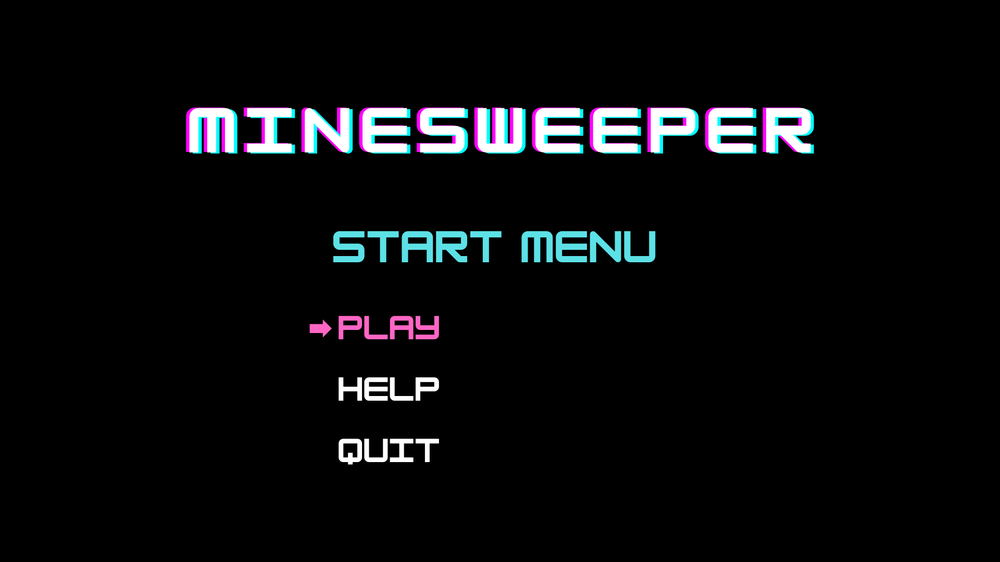
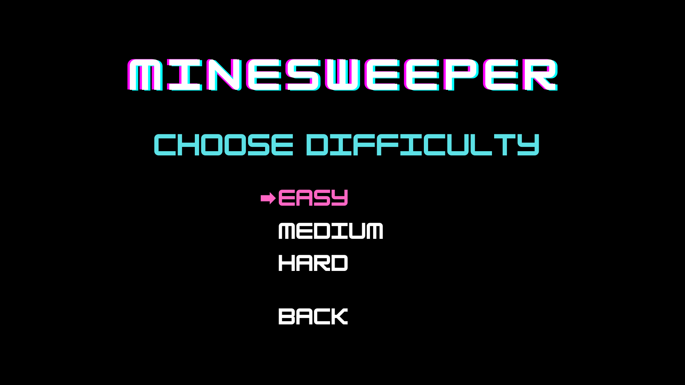
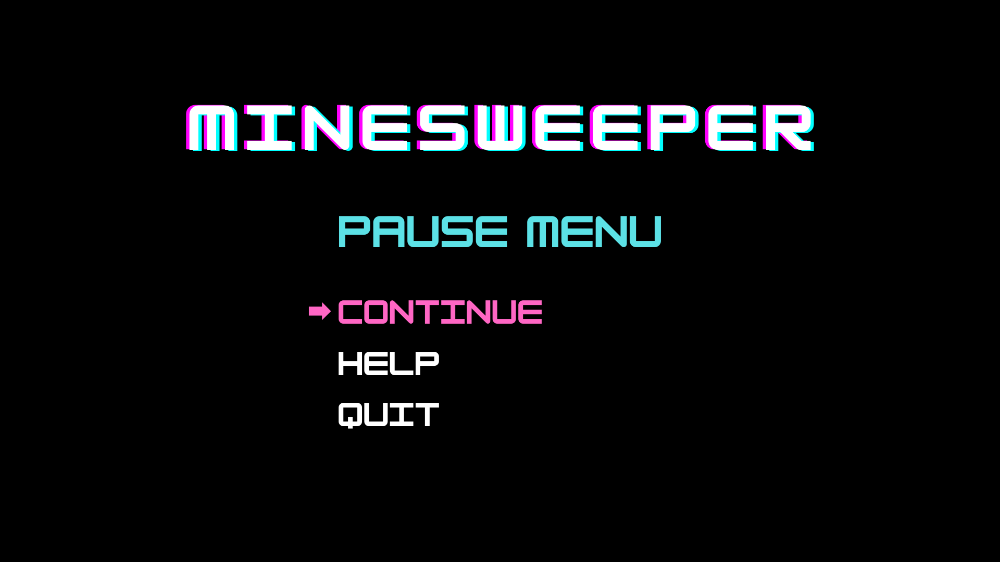
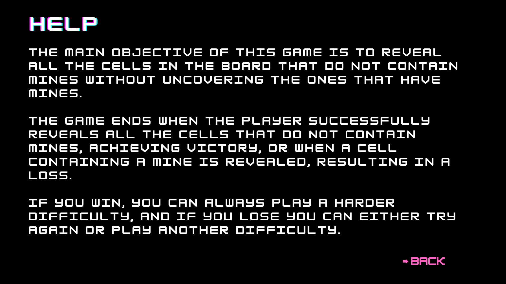
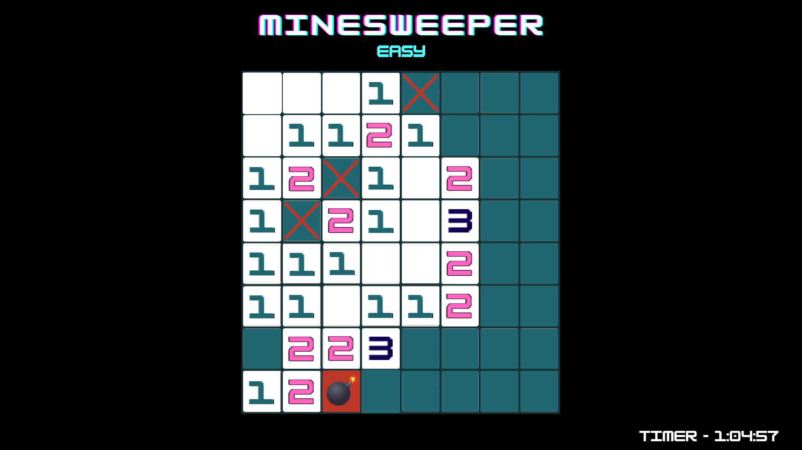
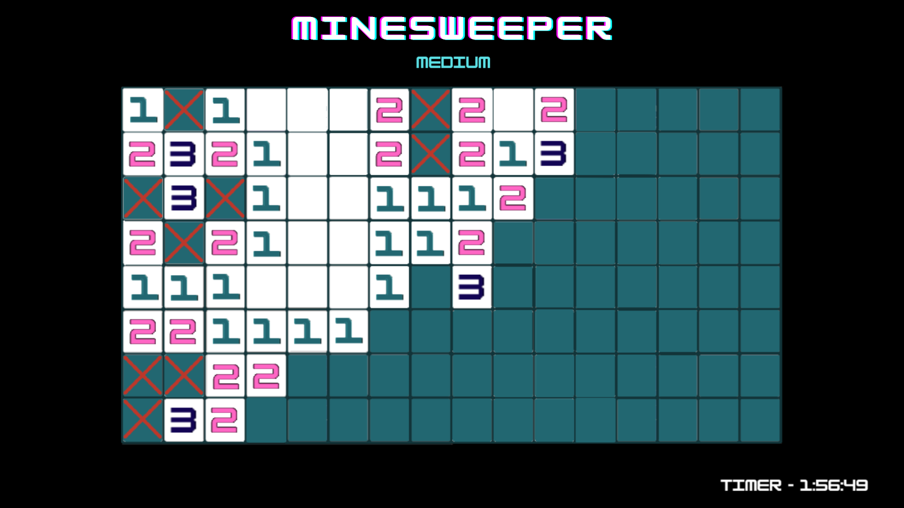
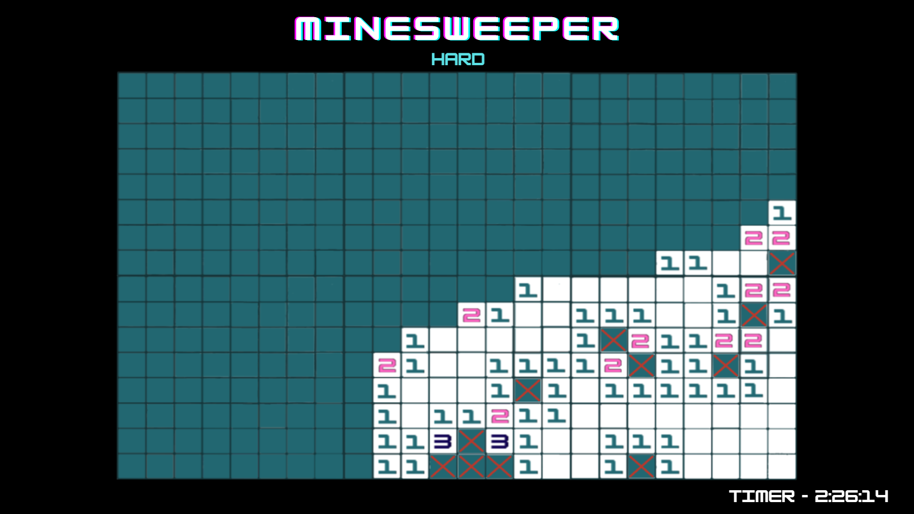
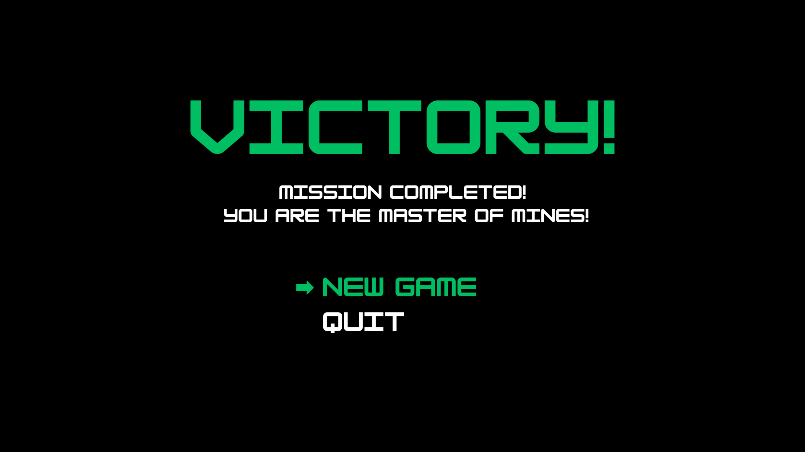
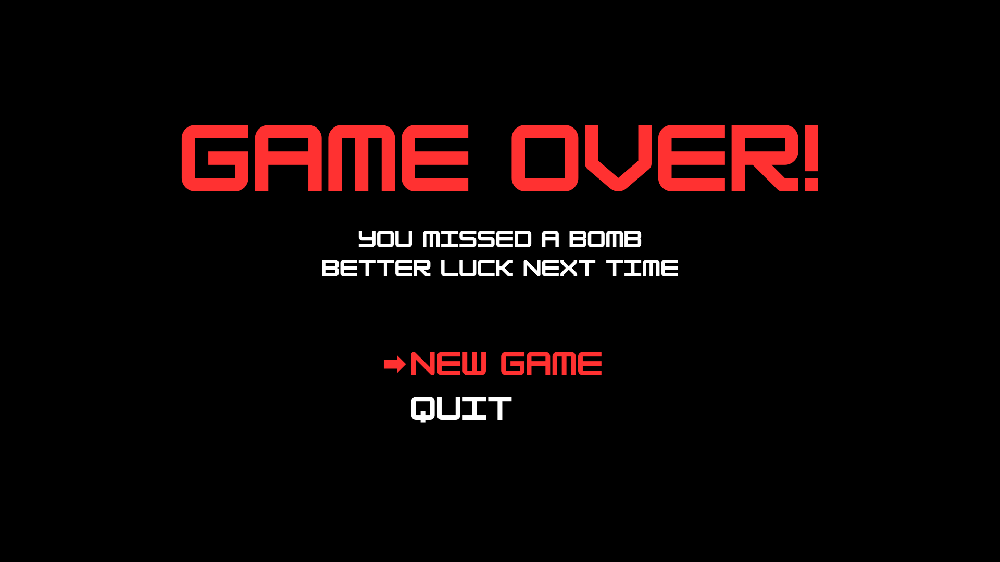

## **LTDS - Minesweeper**

---

This project is inspired by the classical Microsoft Minesweeper game, released in 1990.
The main objective is to **reveal all non-mine cells on the board** while avoiding the
hidden mines.
  
The game ends when the player successfully reveals all the cells that do not contain mines, achieving 
victory, or when a cell containing a mine is revealed, resulting in a loss.

#### **This project was developed by:** 
- **Diogo Alves [up202307104]**
- **Gonçalo Paiva [up202309927]**
- **Tiago Ribeiro [up202307438]**

---

### **1. Objectives**

The main objective is to develop a functional and modular text-based game, adhering to 
**Design Patterns** and **SOLID Principles** to ensure the code is scalable and maintainable.

---

### **2. Features**

### **Implemented Features:**
- **Board generation** with configurable dimensions.
- **Random placement** of mines across the board using a specific algorithm.
- **Difficulty levels**, where higher difficulty incresses the board dimensions and number of mines.
- **Initialization and logic** of cell states ( Hidden, Revealed, Flagged).
- Calculation of the **number of adjacent mines** for each cell.
- Logic for **Revealing cells** and chain reactions.
- Ability to **flag** and **unflag** suspicious cells. 
- A **Timer** to track the game's duration.
- Game-ending conditions:
  - **Victory**: All non-mine cells are revealed.
  - **Defeat**: A mine is revealed.
- Core methods for **rendering** the game elements(Board, Cells, Clock, Cursor).
- Methods for **rendering** the various game states (Menu, Help Page, Victory, Defeat).

### **Features to be Implement**
- All planned features were implemented.

---

### **3. Design**

This project **applies** and **will aim to apply** the fallowing design patterns:
  
### **Structure**

- **Problem in context:** The **Minesweeper** game is complex, involving a lot of 
components, and so we need to organize our code the best way possible. As the complexity
of the game increases, we need a simple structure. To ensure that the code is 
easy to maintain, extend, and read. A well-structured code makes it easier to debug and add new features.

- **The Pattern:** The **MVC (Model-VIew-Controller)** pattern is ideal for this situation.
It separates the game into 3 components:

  - **Model** - Contains the logic of the game.
  - **View** -  Responsible for displaying the model data and receiving user input. 
  - **Controller** - Acts as the mediator between the model and view, interpreting user 
actions and updating the model.

- **Implementation:** The pattern allowed us to divide the code into three parts:
  - [Model](src/main/java/model)
  - [View](src/main/java/view)
  - [Controller](src/main/java/control)

- **Consequences:**
  - The pattern divides the application into three distinct components (Model, View, Controller), each with a specific responsibility.
  - Makes the code adhere to the Single Responsibility principle.
  - Makes the codebase easier to understand, maintain, and extend.
  - Components can be reused across different implementations

  
### **Board Creation**

- **Problem in context:** The Board class represents the central data structure holding the game grid and its state. 
Without proper restrictions, multiple instances of the Board could be created unintentionally, leading to 
inconsistent behavior. For instance, one part of the application might reference a Board where some cells are revealed,
while another part references a different instance. This can cause synchronization issues, as components like the 
Controller and View could operate on different Board instances.

- **The Pattern:** The Singleton Pattern ensures that a class has only one instance throughout the application and 
provides a global point of access to that instance, solving the problem.

- **Implementation:** The Singleton pattern was implemented in the `Board` class as fallows:
  - Ensures that only one instance exists throughout the game by implementing a private constructor to prevent direct
instantiation.
  - Provides a way to access the single instance of the board.
  - Ensures that no instance is accessible before initialization, enforcing controlled instantiation.

  
- The singleton pattern is implemented here: [Board](src/main/java/model/game/Board.java)

- **Consequences:** 
  - All components access the board via `getInstance()`, reducing the risk of synchronization issues.
  - A single board simplifies operations like revealing cells, flagging bombs, and counting adjacent mines.
  - The Singleton introduces global state, increasing coupling between components.
  - Because components accessing the Singleton do not explicitly depend on it (e.g., they call `Board.getInstance()` directly), 
the dependencies on the Singleton are **hidden** in the code.
  - Singletons often make **unit testing** more difficult because mocking the Singleton during testing requires 
additional workarounds (Dependency injection or Factory methods).

  
  
### **Cell Creation**

- **Problem in context:** If the cell creation logic is embedded directly within the `Board` 
class (using `new Cell(false, row, col)`), the process of creating objects becomes repetitive and harder manage. If you 
need to control the creation process of a cell (deciding whether a cell is a `NormalCell` or a `MineCell`), using such
logic would make the `Board` class more complex and tightly coupled to the cell creation process.

- **The Pattern:** The Factory Pattern provides a way to delegate the creation of objects to a centralized factory, 
allowing the client to use those objects without needing to know their specific creation logic. This solves the 
problem of managing object instantiation, ensuring decoupling, consistency and flexibility.

- **Implementation:** The Factory Pattern was implemented in the `CellFactory` class as follows:
  - Centralizes the creation of Cell objects, hiding the object instantiation logic from the client (e.g., the Board class).
  - Determines the specific type of Cell object to create based on input parameters like whether it contains a mine or not.
  - Ensures flexibility by allowing easy extension to support new types of Cell objects, without modifying the client code.

- The Factory pattern is implemented here: [CellFactory](src/main/java/model/game/CellFactory.java).

- **Consequences:**
  - Adding new types of Cell objects becomes easier.
  - Reduces the coupling between the Board and the specific types of Cell objects.
  - The Board class (or any class) is no longer responsible for determining how Cell instances are created.

## **Viewer Creation**

- **Problem in context:** If the viewer creation logic is embedded directly into the different parts of the game 
(for example, directly using `new BoardViewer(board)`), the code becomes repetitive and tightly coupled to specific 
view implementations. This is problematic if you want to decouple logic from UI creation.

- **The Pattern:** The Factory Pattern provides a centralized way to manage the instantiation of view components. 
By delegating the creation logic to a factory, you ensure that the client is not responsible for managing specific
view creation details, improving code organization and scalability. This pattern ensures consistency and makes it 
easier to manage changes to how viewers are created.

- **Implementation:** The Factory Pattern was implemented in the `ViewFactory` class as follows:
  - Centralizes the creation of all key view objects, delegating instantiation responsibility to the factory.
  - Produces and returns the appropriate view object based on the provided model or associated data.
  - Provides flexibility for modifying or extending application views while keeping the client code unaffected.
  

- The Factory pattern is implemented here: [ViewFactory](src/main/java/view/ViewFactory.java)

- **Consequences:** 
  - The client code is no longer responsible for the creation of specific viewer objects.
  - By centralizing the creation logic in a factory, all viewer objects are instantiated in a consistent manner.
  - Viewer creation logic is isolated in the ViewFactory, making it easier to write tests for the factory independently,
as well as mocking viewer objects in client testing scenarios.

### **Game State Management**

- **Problem in Context:**
  The game progresses through different states, such as **menu**, **playing**, **game over**, **victory**, and **help**.
Each of these states requires distinct behaviors, logic, and transitions. Without a clear state management strategy, 
implementing these behaviors can result in tightly coupled, hard-to-maintain controller logic. Making it difficult 
to add or modify states.

- **Applied Patterns:** To address these challenges, we utilized **two design patterns** for managing the game states:
  - **State Pattern**: For encapsulating the behavior and logic of each game state into separate classes.
  - **Factory Pattern**: For centralizing the creation of the state objects via the `FactoryState`, ensuring consistent 
  initialization and better separation of concerns.

**Description:** 

The **State Pattern** enables the game controller to delegate behavior and logic dynamically to
different state objects. Each game state is encapsulated into its own class, inheriting from a common abstract class. 

- **Implementation:** Each state is represented by a class, such as:
    - `MenuState`: Manages menu-related logic.
    - `HelpState`: Manages logic for showing help and instructions.
    - `GameState`: Manages the game's active play logic.
    - `GameOverState`: Handles the game-over defeat behavior.
    - `GameWinState` : Handles the game-over victory behavior.
    - `ControllerState<T>` : Abstract class that ensures consistency in each state.

These classes share a common abstract base (`ControllerState<T>`), ensuring consistency in the methods 
(`changeState()`, `processInput()`, `update()`).

The **Factory Pattern** is used to manage the instantiation of state objects through the `StateFactory`. 
This factory encapsulates the logic of initializing states and their dependencies, ensuring a consistent approach to 
creating game states.

- **Implementation:** The StateFactory class provides methods to instantiate various states, such as:
    - `getMenuState()`: Returns a MenuState  instance, providing the MenuModel and MenuView objects.
    - `getGameState()`: Sets up a new GameState with its Game model and GameViewer.
    - `getHelpState()`: Creates the help state by initializing a HelpModel and its corresponding view.
    - `getGameOverState()` and `getGameWinState()`: Initialize GameOver or winning states and their respective viewers.

The `Controller` only needs to request new states from the `StateFactory` during transitions, such as moving from the menu to the playing state.  
The `StateFactory` centralizes the construction of dependencies (linking models with their viewers).

**How the Patterns Interact:** The **State Pattern** and **Factory Pattern** work together to create a robust, modular state management system for the game.

The Factory pattern is implemented here [StateFactory](src/main/java/control/state/StateFactory.java) and here [State](src/main/java/control/state).

---
#### **Know code SmellsS**

### **6. Mockups**

)

### **Testing**

### **Self evaluation**
