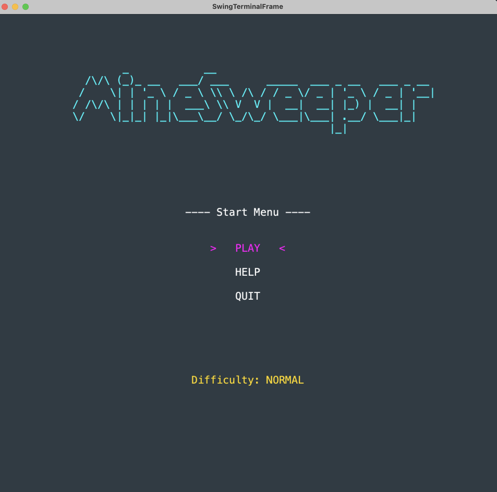
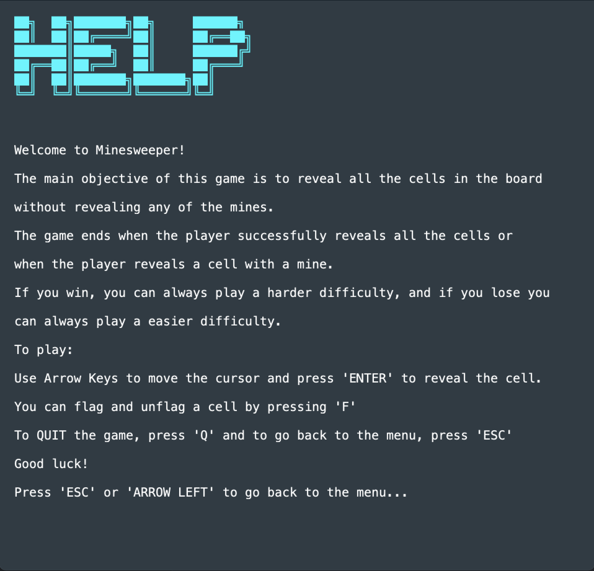
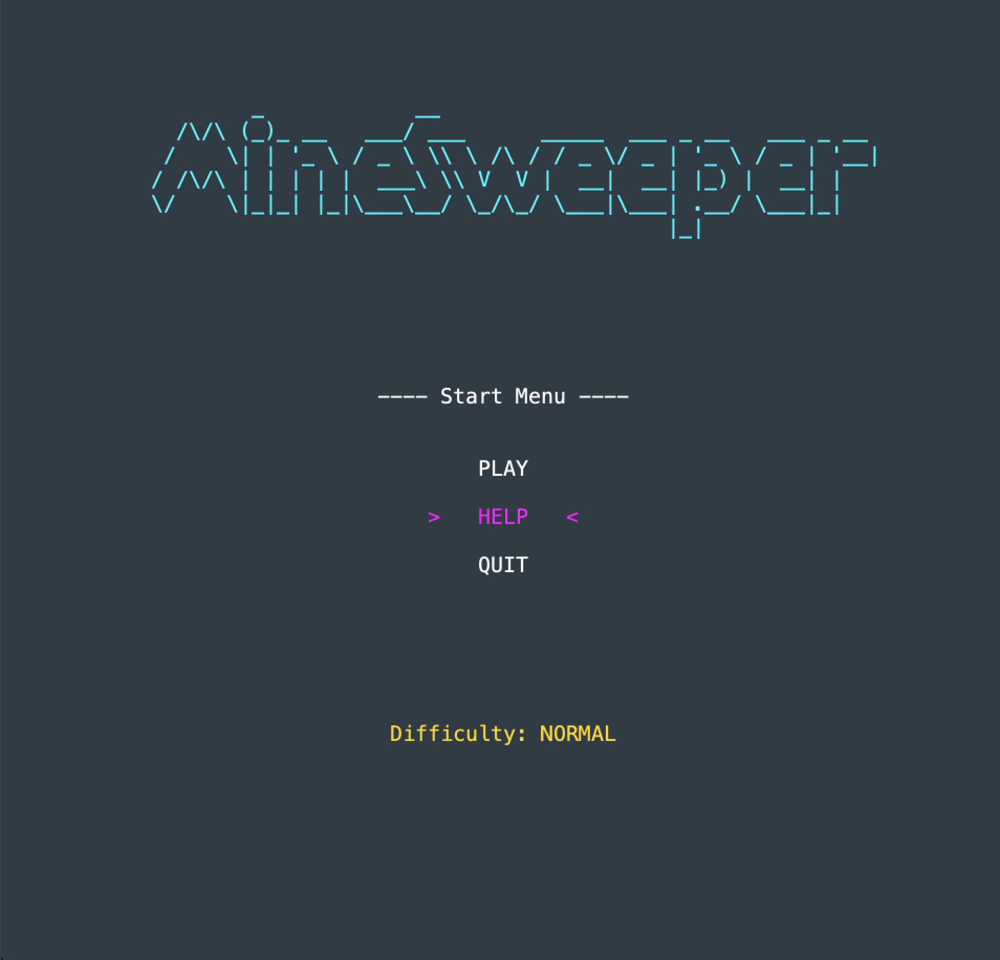
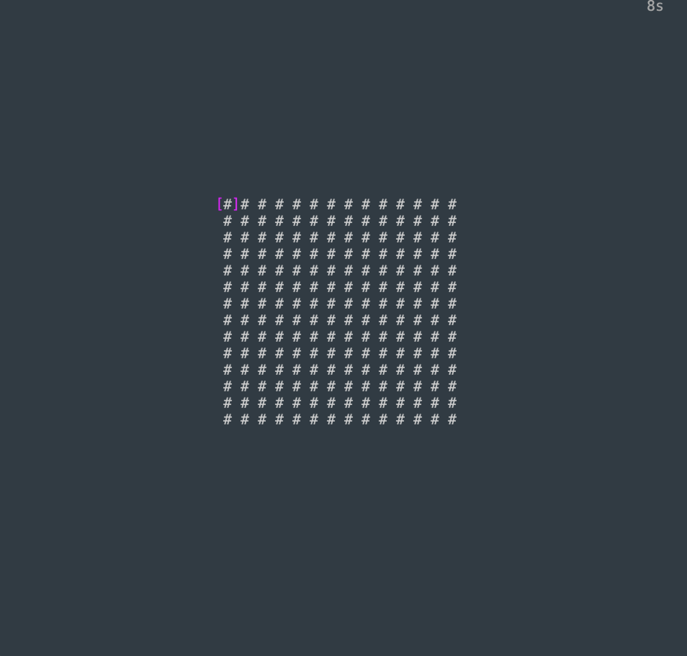
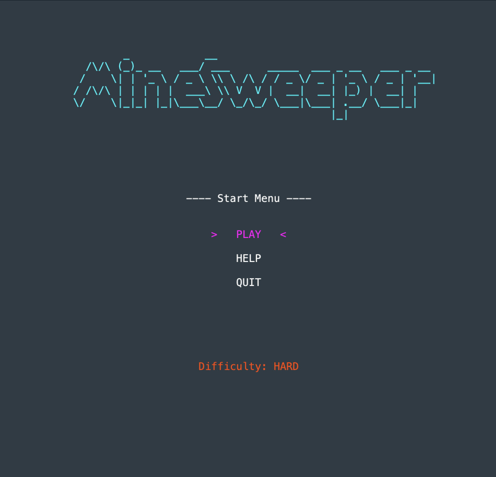
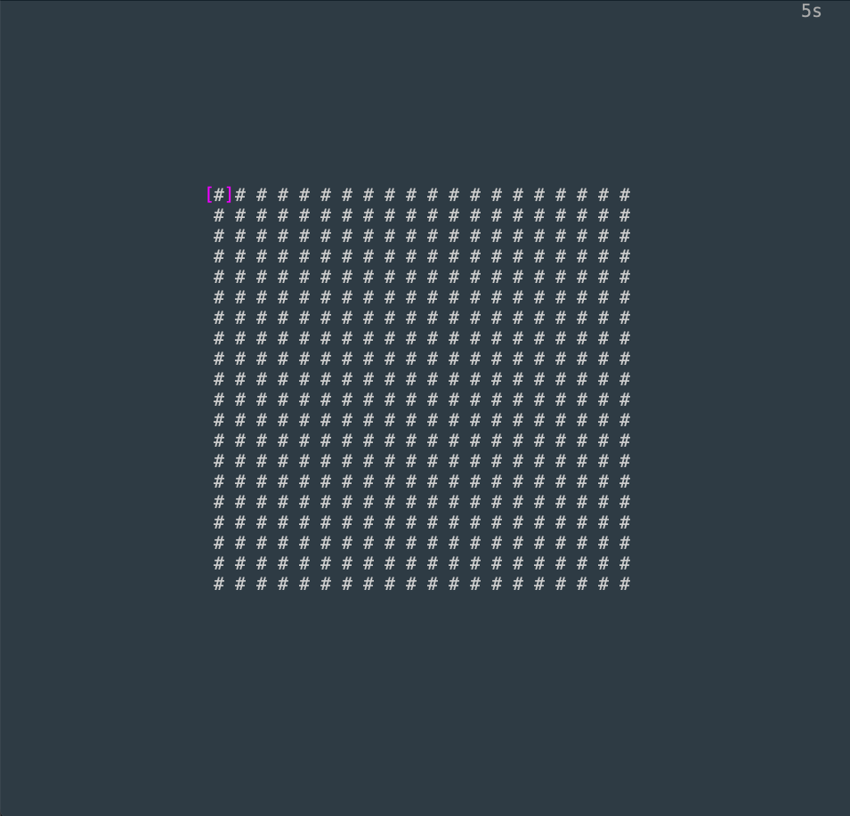
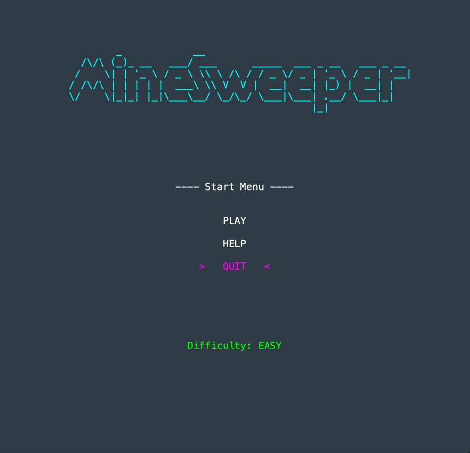
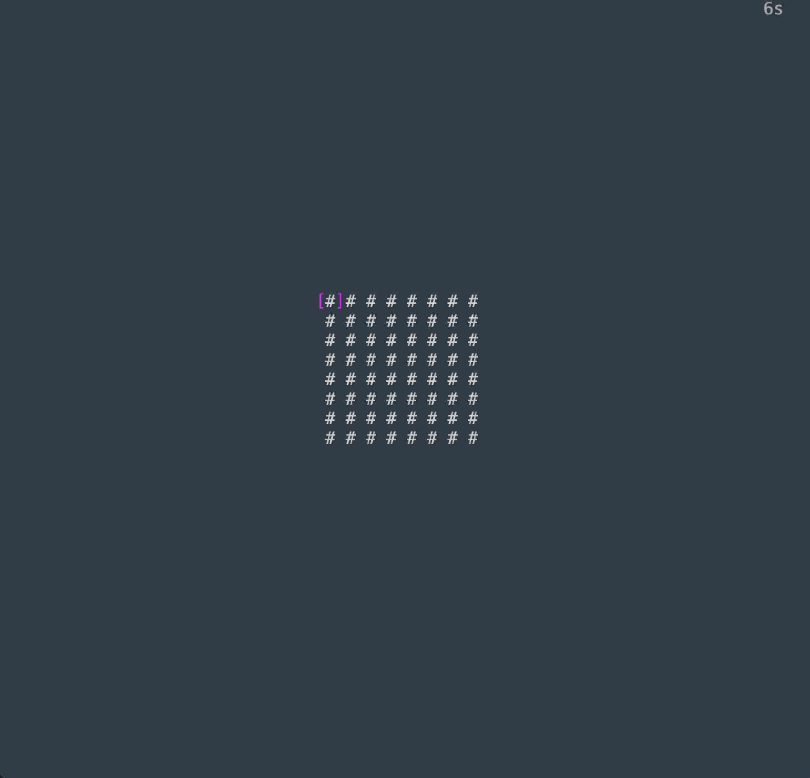

## **LTDS - Minesweeper**

---

This project is inspired by the classical Microsoft Minesweeper game, released in 1990.
The main objective is to **reveal all non-mine cells on the board** while avoiding the
hidden mines.

- **Victory**: All non-mine cells are revealed.
- **Defeat**: A mine is revealed.

#### **This project was developed by:**
- **Diogo Alves [up202307104]**
- **Gonçalo Paiva [up202309927]**
- **Tiago Ribeiro [up202307438]**

For a more detailed version of this description click [here](./docs/README.md). 

---

## **Screenshots**

The following screenshots illustrate the general look of our game, as well as the divergent functionalities:

### **Game preview:**

## **Menu:**

### **Difficulties:**

---

---

