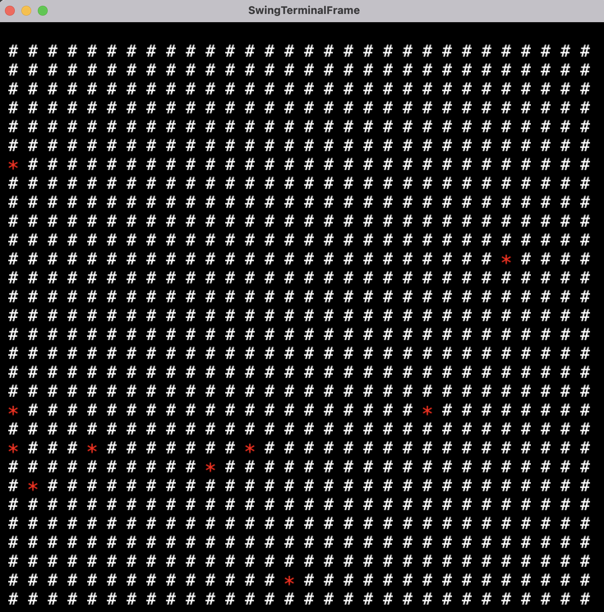

## **LTDS - Minesweeper**

---
 This project is inspired by the classical Microsoft Minesweeper game, released in 1990. 
The main objective is to **reveal all the cells in the board that do not contain mines** without
uncovering the ones that have mines.
  
The game ends when the player successfully reveals all the cells that do not contain mines, achieving 
victory, or when a cell containing a mine is revealed, resulting in a loss.

#### **This project was developed by:** 
- **Diogo Alves [up202307104]**
- **Gonçalo Paiva [up202309927]**
- **Tiago Ribeiro [up202307438]**

---

### **1. Objectives**

The main objective is to develop a functional and modular text-based game, adhering to 
**Design Patterns** to ensure the code is scalable and maintainable.

---

### **2. Features**

### **Implemented Features:**
- Generation of a **board** with specific dimensions.
- **Random placement** of mines on the board.
- Initializing Cell States
- Managing Cell Logic
- Method to draw the board (GUI) 
- Rendering the state of each cell

### **Features to be Implement**
- Counting the number of adjacent mines for each **cell**.
- Logic for revealing cells.
- Ability to mark and unmark suspicious cells.
- Difficulty levels, where higher difficulty incresses the number of mines.
- Timer to track the duration of the game.
- Ability to customize the board dimension based on difficulty.
- Game-ending conditions:
  - **Victory**: All non-mine cells are revealed.
  - **Defeat**: A mine is revealed.
- Addition enhancements and features.

---

### **3. Design**

This project **applies** and **will aim to apply** the fallowing design patterns:
  
### **Structure**

- **Problem in context:** The **Minesweeper** game is complex, involving a lot of 
components, and so we need to organize our code the best way possible. As the complexity
of the game increases, we need a simple structure. To ensure that the code is 
easy to maintain, extend, and read. A well-structured code makes it easier to debug add new features.

- **The Pattern:** The **MVC (Model-VIew-Controller)** pattern is ideal for this situation.
It separates the game into 3 components:

  - **Model** - Contains the logic of the game.
  - **View** -  Responsible for displaying the model data and receiving user input. 
  - **Controller** - Acts as the mediator between the model and view, interpreting user 
actions and updating the model.

- **Implementation:** The pattern allowed us to divide the code into four parts:

  - **Model** - Handles the **game logic** and data. Such as the **Board** (grid of cells)
and **Cells** (each with a state: revealed, flagged, mine, etc.). 

  - **View** - Displays the model data to the user. It is responsible for drawing the game elements
(board, mines, hidden cells, adjacent mines counts)
  
  - **Controller** - Manages the fame rules and flow. Interpreting the **Game** states 
(revealing a cell, flagging a cell, and checking win/lose conditions) 

**Note** - as we develop the game we will implement other patterns like:
- The **Singleton pattern**, for know our code does not implement this patterns
because classes Like GameScreen, Board, Game are instantiated directly using new, allowing
multiple instances to be created.

---

#### **4. classes**
- **In development:**
  - Cell 
  - Board
  - GameScreen
  - main

**Note** - We specifically plan to implement a Game class, to deal with the game rules and flow 
and user actions. 

---
### **5. Beta Game Screenshot**

**Note:** Currently, the game is unable to process user input. This screenshot only illustrates
how the board is drawn (rendered) at this stage of the game. The '#' represent the yet hidden cells and the red '*' represent
the mines. The mines are not hidden in this screenshot, as we wanted to verify if our methods were working correctly.

### **5. Diagramas UML**

### **6. Mockups**

### **7. Testes**
