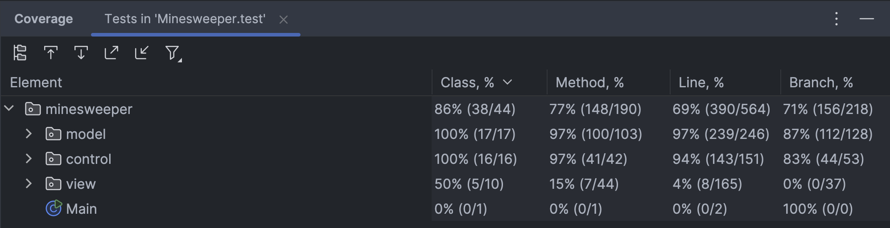
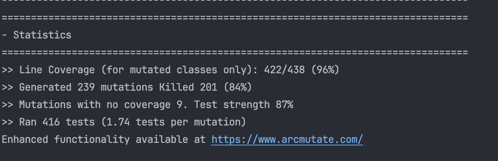

## **LTDS - Minesweeper**

---

This project is inspired by the classical Microsoft Minesweeper game, released in 1990.
The main objective is to **reveal all non-mine cells on the board** while avoiding the
hidden mines.

- **Victory**: All non-mine cells are revealed.
- **Defeat**: A mine is revealed.

#### **This project was developed by:** 
- **Diogo Alves [up202307104]**
- **Gonçalo Paiva [up202309927]**
- **Tiago Ribeiro [up202307438]**

---

## **1. Objectives**

The main objective is to develop a functional and modular text-based game, adhering to 
**Design Patterns** and **SOLID Principles**. Ensuring the code is scalable, maintainable, and easy to extend.

---

## **2. Features**

### **Implemented Features:**
- **Board generation** with configurable dimensions.
- **Random placement** of mines across the board using a specific algorithm.
- **Difficulty levels**, with adjustable board dimensions and mine count.
- **Cell states:** Hidden, Revealed, Flagged.
- **Adjacent mine count** calculation for each cell.
- Logic for **Revealing cells** and chain reactions.
- Ability to **flag/unflag** suspicious cells. 
- A **Timer** to track the game's duration.
- **Game states:** Menu, Help Page, Victory, Defeat and Game.
- Rendering methods for the elements (**board**, **cells**, **clock**, and **cursor**) and states of the game.

### **Features to be Implement**
- All planned features are implemented.

---

## **3. Design**

This project applies the fallowing **design patterns**:
  
### **Structure**

- **Problem in context:**
The **Minesweeper** game involves numerous components, making it crucial to adopt a well-organized structure.
As the complexity of the game increases,maintaining a clear, scalable, and readable codebase is essential.
A well-structured design simplifies debugging, extending features, and overall maintenance.

- **The Pattern:** 
The **MVC (Model-VIew-Controller)** pattern is ideal for this situation. It separates the game into 3 components:

  - **Model** - Handles the game's logic and data.
  - **View** -  Displays the game data to the player and captures user input.
  - **Controller** - Mediates between the Model and View, processing user actions and updating the Model accordingly.

- **Implementation:** The MVC pattern is implemented as follows:
  - [Model](../src/main/java/minesweeper/model): Encapsulates game rules and data structures
  - [View](../src/main/java/minesweeper/view): Manages user interface and visual elements.
  - [Controller](../src/main/java/minesweeper/control): Interprets inputs and orchestrates changes between the Model and View.

  

  <b><i>Fig 1. Model, Controller and Viewer pattern design</i></b>

- **Consequences:**
  - Each component has a clear responsibility, adhering to the Single Responsibility Principle.
  - The codebase is easier to understand, maintain, and extend.
  - Makes the codebase easier to understand, maintain, and extend.
  - Components can be reused across different implementations.

  
### **Board Creation**

- **Problem in context:** The Board class serves as the central data structure for holding the game grid and its state.
  Without proper restrictions, multiple instances of the `Board` could unintentionally be created, leading to inconsistent behavior.
  For example:
  - One component might reference a `Board` where certain cells are revealed, while another operates on a different instance.
  - These synchronization issues can cause errors as the `Controller` and `View` might work with different versions of the board.
  

- **The Pattern:** ensures that only one instance of the `Board` class exists throughout the application and provides a global point of access to that instance, solving the problem.

- **Implementation:** The Singleton pattern is applied in the `Board` class as follows:
  - The constructor is declared private to prevent direct instantiation.
  - A static method (`getInstance()`) provides access to the single instance of the board.
  - Initialization is strictly controlled, ensuring that no instance is accessible before proper setup.
  
  
- The singleton pattern is implemented here: [Board](../src/main/java/minesweeper/model/game/Board.java)

  

  

  <b><i>Fig 2. Singleton pattern design</i></b>

  The UML diagram illustrates the Singleton Pattern. The `Board` class contains a private constructor, a static instance variable, and a static `getInstance()` method to provide controlled access.

- **Consequences:** 
  - **Benefits:**
    - Reduces synchronization risks by ensuring all components access the same board instance via `getInstance()`.
    - Simplifies core operations such as revealing cells, flagging bombs, and counting adjacent mines.
  - **Compromises:**
    - Introduces global state, increasing coupling between components.
    - Hidden dependencies make the code harder to test, requiring workarounds like dependency injection or factory methods.
  
  
### **Cell Creation**

- **Problem in context:** Embedding the cell creation logic directly within the Board class (e.g., using `new Cell(false, row, col)`) results in repetitive code and increased complexity.
  For instance, deciding whether to create a `NormalCell` or a `MineCell` would make the Board class more complex and tightly coupled to the cell creation process. 
  This design is hard to maintain and extend.

- **The Pattern:** The Factory Pattern delegates the responsibility of object creation to a centralized factory.
  This allows clients to create objects without needing to know the specific instantiation details. This solves the 
  problem of managing object instantiation, ensuring decoupling, consistency and flexibility.

- **Implementation:** The Factory Pattern is implemented in the `CellFactory` class as follows:
  - Centralizes the creation of Cell objects, hiding instantiation logic from clients (e.g., the `Board` class).
  - Determines the specific type of Cell to create based on input parameters (e.g., whether the cell contains a mine).
  - Ensures flexibility by allowing easy extensions to support new types of Cell objects without modifying existing client code.

- The Factory pattern is implemented here: [CellFactory](../src/main/java/minesweeper/model/game/CellFactory.java).

  

  

  <b><i>Fig 3. Cell Factory pattern design</i></b>

- **Consequences:**
  - Simplifies adding new types of Cell objects.
  - Decouples the Board class from the details of Cell creation.
  - Frees the Board class (and others) from directly managing how Cell instances are created.

### **Viewer Creation**

- **Problem in context:** If the viewer creation logic is embedded directly into the different parts of the game 
  (for example, directly using `new BoardViewer(board)`), the code becomes repetitive and tightly coupled to specific 
  view implementations. This is problematic if you want to decouple logic from UI creation.

- **The Pattern:** The Factory Pattern offers a centralized approach for managing the instantiation of view components. 
  By delegating the creation logic to a factory, the client is relieved of the responsibility of handling specific view creation details. 
  This improves code organization and scalability, ensures consistency, and simplifies the process of managing changes to how viewers are created.

- **Implementation:** The Factory Pattern has been implemented in the `ViewFactory` class as follows:
  - Centralizes the creation of all key view objects, delegating the instantiation responsibility to the factory.
  - Produces and returns the appropriate view object based on the provided model or associated data.
  - Provides flexibility for modifying or extending application views without affecting client code.
  

- The Factory pattern is implemented here: [ViewFactory](../src/main/java/minesweeper/view/ViewFactory.java)

  

  

  <b><i>Fig 4. Viewer Factory pattern design</i></b>

- **Consequences:**
  - The client code is no longer responsible for creating specific viewer objects.
  - Centralizing the creation logic in a factory ensures that all viewer objects are instantiated consistently.
  - Viewer creation logic is isolated within the `ViewFactory`, facilitating independent testing of the factory and 
  enabling easier mocking of viewer objects in client testing scenarios.

### **Game State Management**

- **Problem in Context:** The game progresses through different states, such as **menu**, **playing**, **defeat**, **victory**, and **help**.
  Each of these states requires distinct behaviors, logic, and transitions. Without a clear state management strategy, implementing 
  these behaviors can result in tightly coupled, hard-to-maintain controller logic. Making it difficult to add or modify states.

- **Applied Patterns:** To address these challenges, we utilized **two design patterns** for managing the game states:
  - **State Pattern**: This pattern encapsulates the behavior and logic of each game state within distinct classes.
  - **Factory Pattern**: This pattern centralizes the creation of state objects through the StateFactory, ensuring consistent 
  initialization and promoting better separation of concerns.

  **Description:** 

  The **State Pattern** allows the game controller to dynamically delegate behavior and logic to different state objects. 
  Each game state is defined in its own class, which inherits from a common abstract class.

- **Implementation:** Each state is represented by a class, such as:
    - `MenuState`: Manages menu-related logic.
    - `HelpState`: Manages the display of help and instructions.
    - `GameState`: Controls the active gameplay logic.
    - `GameOverState`: Manages the behavior upon game defeat.
    - `GameWinState`: Handles the behavior upon game victory.
    - `ControllerState<T>`:  An Abstract class that ensures consistency in each state.

These classes share a common abstract base (`ControllerState<T>`), ensuring consistency in the methods 
(`changeState()`, `processInput()`, `update()`).

  

  

  <b><i>Fig 5. State pattern design</i></b>

The **Factory Pattern** is used to manage the instantiation of state objects via the `StateFactory`. 
This factory encapsulates the logic of initializing states and their dependencies, ensuring a consistent approach to 
creating game states.

- **Implementation:** The StateFactory class provides methods to instantiate various states, such as:
  - `getMenuState()`: Returns an instance of MenuState, along with the associated MenuModel and MenuView.
  - `getGameState()`: Instantiates a new GameState with its corresponding game model and viewer.
  - `getHelpState()`: Initializes the help state using a HelpModel and its corresponding view.
  - `getGameOverState()` and `getGameWinState()`: Create instances of the game-over and victory states, along with their respective viewers.

The `Controller` simply requests new states from the `StateFactory` during transitions, such as switching from the menu to the playing state. 
This centralization allows for easier management of dependencies, linking models with their viewers.

  

  

  <b><i>Fig 6. State Factory pattern design</i></b>

**How the Patterns Interact:** The **State Pattern** and **Factory Pattern** work together to create a robust, modular state management system for the game.

The Factory pattern and State pattern are implemented here [StateFactory](../src/main/java/minesweeper/control/state/StateFactory.java) and here [State](../src/main/java/minesweeper/control/state).

---

### **Adherence to SOLID Principles**

  **Single Responsibility Principle (SRP):**
  - Each class has a single responsibility and operates independently.
  - The MVC pattern helps to fallow this principle. 
  - Example: The Game class handles the game logic, while the Board class manages the board structure and. The GameClock handles time-tracking functionality.

  **Open/Closed Principle (OCP):**
  - Classes should be open for extension but closed for modification.
  - Example: The Factory Pattern allows adding new cell types (like NormalCell and MineCell) without changing the existing Board class.

  **Liskov Substitution Principle (LSP):**
  - Subclasses should be substitutable for their parent classes without altering the system’s behavior.
  - Example: MineCell and NormalCell extend the Cell abstract class, allowing them to be used interchangeably while maintaining specific behaviors.
  - Example: All states of the game implements the ControllerState abstract class, allowing them to be used interchangeably while maintaining specific behaviors.

  **Interface Segregation Principle (ISP):**
  - Interfaces are designed to focus on specific behaviors rather than bloating a general interface
  - Example: The ControllerState<T> interface defines essential methods (update, processInput) for different game states, keeping the interface modular and focused.

  **Dependency Inversion Principle (DIP):**
  - High-level modules should not depend on low-level modules; both should depend on abstractions.
  - Example: The ViewFactory creates view objects based on abstractions, allowing for easier decoupling from specific implementations.

---
#### **Know code Smells**
  We tried fix all the errors reported by error-prone. No other major code smells identified.

### **Testing**

Screenshot of coverage report:

Link to the mutation testing report:

 - [Mutation Tests](../build/reports/pitest/index.html)

### **Self evaluation**

- **Diogo Alves: 50%**
- **Gonçalo Paiva: 20%**
- **Tiago Ribeiro: 30%**
